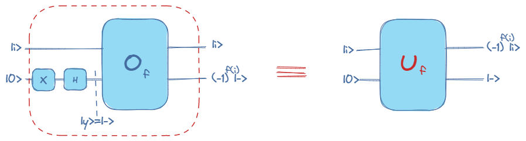

# Deutsch Jozsa Strikes Again

I am writing this documentation to share with you the line of thinking that led me to the problem solution as well as to explain the code more thoroughly.

Let’s first start with the problem statement:
> The Deutsch-Jozsa algorithm was one of the first to demonstrate a quantum advantage. 
> Briefly, we are given a black-box function (or oracle) f : {0, 1}N → {0, 1} , which satisfies one of these two properties: 
> - f is constant: it always returns the same value (it can be 0 or 1). 
> - f is balanced: half of the values, it takes the value 0 and for the other half, the value 1. 
> 
> An oracle with these characteristics needs three qubits: the first two qubits represent the input x, and the third qubit marks the output f(x). 
> 
> Here, we will be looking at a variation of the original Deutsch-Jozsa problem: we are given four different functions f0, f1, f2 and f3 representing four different oracles which are either constant or balanced. As before, each oracle is a 3-qubit 1 operator: the first two qubits represent the input to the function and the third qubit is the output. We are guaranteed that this set of functions satisfies one of the following conditions: 
> - All functions are constant. 
> - All functions are balanced. 
> - Two functions are constant and two are balanced. 
> 
> The objective of this challenge is to determine whether the four functions are of the same type (all constant or all balanced) or are equally split (two functions are constant and two are balanced). You are only allowed to run one shot in one circuit, and you may not use more than eight qubits.

For the sake of the compactness of the explanation, I am going to go through some essential elements already mentioned in the problem statement in order to build our understanding of the task at hand.

1. Oracle

Given a function f:{0,1}N →{0,1} , it can be encoded with a combination of quantum gates such that the input is a bit string of length N (represented by n qubits) and the output is represented by a single qubit: y=f(i).

But, as we know, quantum computation theory implies that any transformation should be unitary and thus reversible meaning that given the output of the oracle, one can systematically determine the input value.
In order to ensure this high order rule, a quantum oracle is rather represented in this way where we add an ancillary qubit in which we encode the output of the function while keeping the input qubits unchanged:

A more general representation of an oracle is the following where the ancillary qubit is arbitrary( a superposition of the basis states |0> and |1>) and the effect of encoding the function output in the ancillary qubit is given by the formula: y xor f(i).

If we prepare the ancillary qubit in |-> state, we will obtain an oracle independent of |y>, which performs the map Uf|i>=(-1)f(i)|i>:

Note: This mapping formula could be simply obtained by developing “y xor f(i)” for y in {0,1}.

2. Deutsch Jozsa algorithm

The goal of the Deutsch Jozsa algorithm is to determine whether a function of the type  f:{0,1}N →{0,1} is constant or balanced using only one call to the corresponding oracle.

=|0>^{n}|y> }">

The hadamard transform on the state |0>n creates a superposition of all possible basis states (2n basis states)

=H^{n}|\phi1>=\frac{1}{\sqrt{2^{n}}}\displaystyle\sum_{x \in \{0,1\}^{n}} |x>|y> }">

The intuition behind applying the hadamard transform before applying the oracle is that we can obtain in a single state the evaluation of the f function on all Xs in the input space encoded in the amplitude of the corresponding basis state.

=U_{f} |\phi2> =\frac{1}{\sqrt{2^{n}}}\displaystyle\sum_{x \in \{0,1\}^{n}} U_{f}|x>|y>= \frac{1}{\sqrt{2^{n}}}\displaystyle\sum_{x \in \{0,1\}^{n}} (-1)^{f(x)}|x>|y>}">

However, these amplitudes don't change the probability of measuring a particular state and all states are still equiprobable after this transformation since the probability of measuring a basis state |x> according to the born rule is : 
|^{2} =|\alpha_{i}|^{2} = \frac{1}{2^{n}} \text{ where  }\alpha_{i}= \left\{\begin{array}{ll} \frac{1}{\sqrt{2^{n}}} \\ \frac{-1}{\sqrt{2^{n}}}\end{array}\right.}">

That’s why we need to have the information about the evaluations of f on all basis states condensed in the amplitude of one basis state. Another hadamard transform will do the job. 

=H^{n}|\phi3>=\frac{1}{\sqrt{2^{n}}}\displaystyle\sum_{x \in \{0,1\}^{n}} (-1)^{f(x)}H^{n}|x>|y> = \frac{1}{2^{n}}\displaystyle\sum_{x \in \{0,1\}^{n}} (-1)^{f(x)}\displaystyle\sum_{k \in \{0,1\}^{n}} (-1)^{k.x}|k>|y> = \displaystyle\sum_{k \in \{0,1\}^{n}} (\displaystyle\sum_{x \in \{0,1\}^{n}} \frac{1}{2^{n}}(-1)^{f(x) %2B k.x})|k>|y> = \displaystyle\sum_{k \in \{0,1\}^{n}} C_{k} |k>|y>}">

If we examine the amplitude C0 of the |0>n state, a very interesting result will emerge:

=|0>^{n}|y> \text{(because the state is normalized)}  \\ -1 \text{ if} f=1 \Rightarrow |\phi4>=-|0>^{n}|y>\\0 \text{ if} f balanced \Rightarrow |\phi4>=\displaystyle\sum_{\mathclap{k \in \{0,1\}^{n}, k \ne 0^{n}}} C_{k} |k>|y> \end{array}\right.   }">

As a result, the probability of measuring the |0>n state is:

|^{2} =|C_{0}|^{2} =  \left\{\begin{array}{ll} 1 \text{ if f is constant} \\ 0 \text{ if f is balanced}\end{array}\right.}">

And that's how, by making a single measurment, we can determine the nature of the boolean f function.

All these details being set up, we are now ready to build our solution.

We are now dealing with the following function: h:{f0,f1,f2,f3} → {0,1} modeled by this oracle:

As mentioned in the problem statement, the task at hand is to determine whether h is constant or balanced which is equivalent to determining if all fi  are of the same type (all balanced : h=0 /all constant: h=1 → h is constant) or if two are constant and two are balanced (h(i)=h(i')=1 and h(j)=h(j')=0 → h is balanced)

Clearly, if we succeed in implementing such an oracle and feed it to the DJ circuit, our problem will be solved. 

Now the question that should be raised is, during the implementation of the h oracle how can we determine for a specific input |i> if fi is whether constant or balanced ?
The best algorithm that we know of for this task is the DJ algorithm.
Moreover, we notice that h(fi) is equal to the probability of the |00..000> basis state in the "DJ fi" circuit final state. In other words, If the |0>n state is present in the final state of the DJ circuit applied on fi(meaning that fi is constant), then h should be equal to 1 and if the |0> state is absent (meaning that fi is balanced), then h should be equal to 0.
This logical reasoning can be easily translated into a controlled gate which flips the h oracle ancillary qubit if the state |0>n is present in the final state of the DJcircuit applied on fi.

Here is the general structure of the Uh oracle.

Another small detail is the multiplexer gate that will enable us to select the oracle fi in the DJ circuit when the input to the global oracle(h oracle) is |i>.
The structure of this gate will be further explained in the code implementation.

